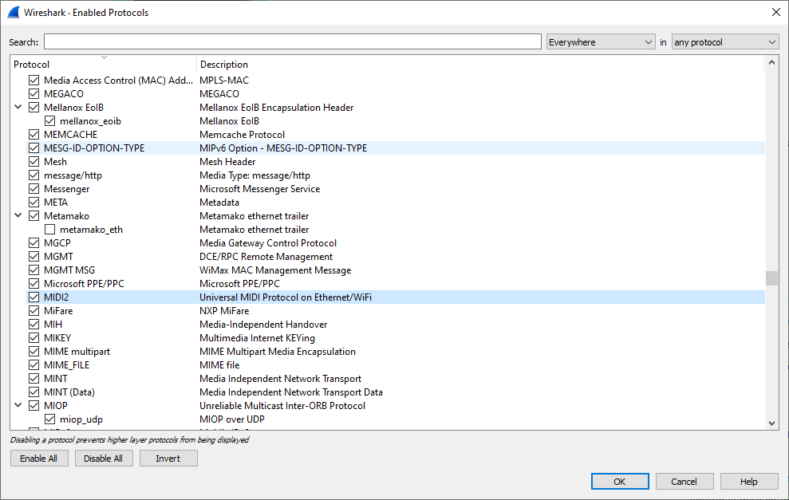

This plugin allows Wireshark to decode incoming Network UMP (Universal MIDI Packet) from a network adapter.

The plugin is still in early development stage and decodes mainly Command Headers in order to identify command packets present in the UDP Payload. It does not yet decode MIDI content of "UMP Data packets" (Command = 0xFF)
The plugin is based the V0.7.6 protocol preliminary specification 

### How to install the plugin
* Copy the the Lua file in the Wireshark installation directory, in the /plugin subfolder (on Windows machines, it is typically c:\Program Files\Wireshark\plugin)
* Start Wireshark
* Open Analyze / Enabled Protocols
* In the dialog that opens, check that MIDI2 protocol is visible. If not, it means that the Lua plugin has not been copied into the correct folder
* Verify that the MIDI2 checkbox is checked. If not, check it in order to enable protocol decoding

* Click on OK to close dialog

Plugin is now ready to use
